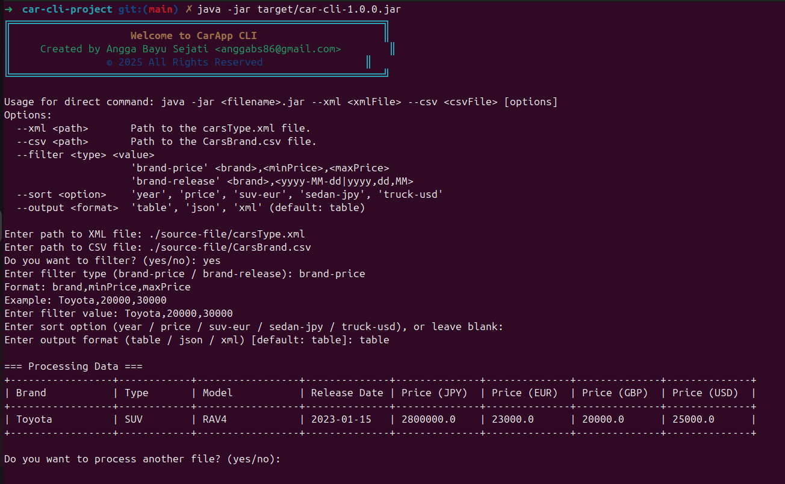

# Car CLI Project

A simple Java command-line application for managing and filtering car data from various sources (CSV, XML) with sorting and output formatting features.

## Features
- **Command Line Interface (CLI)**:
  - User-friendly prompts for specifying:
    - Input files
    - Filters (e.g., brand, type)
    - Sorting options (e.g., year, price)
    - Output formats
  - Clear, formatted table display
- **Validation**:
  - Checks if file paths exist before processing
  - Ensures correct file format (CSV/XML)
  - Prompts user until valid input is entered
- **Error Handling**:
  - Invalid file format → shows descriptive error
  - Missing data → warns user without crashing
  - Unsupported filter or sort criteria → friendly message with suggestions
- **Extensibility**:
  - Easily add new filters, sorting criteria, or output formats
  - Modular service layer for parsing, filtering, and sorting
- **Documentation**:
  - Step-by-step installation
  - Usage guide with examples
  - Developer notes for extending functionality

---

## Project Structure
```
car-cli-project/
├── pom.xml                          # Maven project configuration
├── source-file/                     # Data source files
│   ├── CarsBrand.csv                 # Car brand data
│   └── carsType.xml                  # Car type data
└── src/main/java/app/               # Main Java source directory
    ├── cli/
    │   └── CarApp.java               # Main CLI entry point
    ├── constant/
    │   └── AppConstant.java          # Application constants
    ├── model/
    │   └── Car.java                  # Car data model
    ├── output/
    │   └── OutputFormatter.java      # Output formatting utilities
    └── service/                      # Service layer
        ├── CarParser.java            # Parses CSV/XML into Car objects
        ├── CarFilter.java            # Filtering logic
        └── CarSorter.java            # Sorting logic
```

## Requirements
- Java 17+
- Maven 3.8+
- (Optional) IDE like IntelliJ IDEA or Eclipse

## How to Run
1. **Clone the repository**  
   ```bash
   git clone https://github.com/your-username/car-cli-project.git
   cd car-cli-project

2. **Build the project**
```bash
mvn clean install
```

```bash
mvn -q -DskipTests package
```

3. **Run The Application**

**Directly Run :** 

```bash
java -jar <filename>.jar --xml <xmlFile> --csv <csvFile> [options]
Options:
  --xml <path>       Path to the carsType.xml file.
  --csv <path>       Path to the CarsBrand.csv file.
  --filter <type> <value>
                     'brand-price' <brand>,<minPrice>,<maxPrice>
                     'brand-release' <brand>,<yyyy-MM-dd|yyyy,dd,MM>
  --sort <option>    'year', 'price', 'suv-eur', 'sedan-jpy', 'truck-usd'
  --output <format>  'table', 'json', 'xml' (default: table)
```

Example : 
```bash
java -jar target/car-cli-1.0.0.jar \
  --xml ./source-file/carsType.xml \
  --csv ./source-file/CarsBrand.csv \
  --sort year \
  --output json
```

**Interactively Run :** 

Example : 
```bash
➜  car-cli-project java -jar target/car-cli-1.0.0.jar ↵
╔══════════════════════════════════════════════════════════════╗
║                    Welcome to CarApp CLI                     ║
║     Created by Angga Bayu Sejati <anggabs86@gmail.com>        ║
║                © 2025 All Rights Reserved                 ║
╚══════════════════════════════════════════════════════════════╝

Usage: java -jar <filename>.jar --xml <xmlFile> --csv <csvFile> [options]
Options:
  --xml <path>       Path to the carsType.xml file.
  --csv <path>       Path to the CarsBrand.csv file.
  --filter <type> <value>
                     'brand-price' <brand>,<minPrice>,<maxPrice>
                     'brand-release' <brand>,<yyyy-MM-dd|yyyy,dd,MM>
  --sort <option>    'year', 'price', 'suv-eur', 'sedan-jpy', 'truck-usd'
  --output <format>  'table', 'json', 'xml' (default: table)

Enter path to XML file: ./source-file/carsType.xml ↵
Enter path to CSV file: ./source-file/CarsBrand.csv ↵
Do you want to filter? (yes/no): yes ↵
Enter filter type (brand-price / brand-release): brand-price ↵
Format: brand,minPrice,maxPrice
Example: Toyota,20000,30000
Enter filter value: Toyota,20000,30000 ↵
Enter sort option (year / price / suv-eur / sedan-jpy / truck-usd), or leave blank:  ↵
Enter output format (table / json / xml) [default: table]: table ↵

=== Processing Data ===
+-----------------+------------+-----------------+--------------+--------------+--------------+--------------+--------------+
| Brand           | Type       | Model           | Release Date | Price (JPY)  | Price (EUR)  | Price (GBP)  | Price (USD)  |
+-----------------+------------+-----------------+--------------+--------------+--------------+--------------+--------------+
| Toyota          | SUV        | RAV4            | 2023-01-15   | 2800000.0    | 23000.0      | 20000.0      | 25000.0      |
+-----------------+------------+-----------------+--------------+--------------+--------------+--------------+--------------+

Do you want to process another file? (yes/no): ↵
```

**Validation Logic**

- File Existence Check — Ensures the file path entered actually exists.

- Retry Prompt — Asks the user to re-enter until a valid path is provided.

- Error Messages — Clear, descriptive feedback for invalid inputs.

**Output CLI Application**
